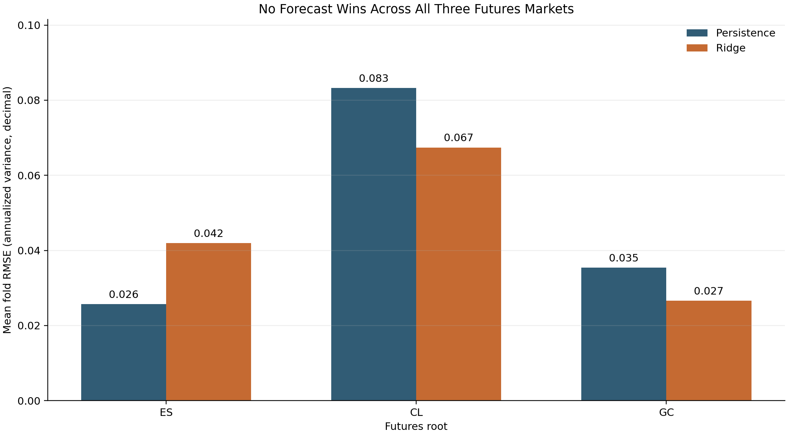
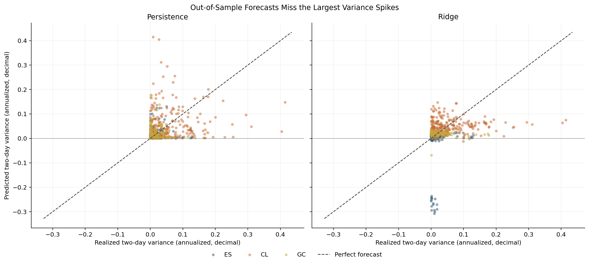

# Auditing a Futures Variance Forecast: When One Shift Changes the Experiment

The original question looked modest: can the shape of a futures curve help forecast variance over the next two sessions? The project had the right broad pieces: continuous contracts, term-structure features, a persistence benchmark, ridge regression, and walk-forward tests across E-mini S&P 500 (ES), crude oil (CL), and gold (GC).

Then I traced the target one row at a time.

That audit found three timing problems: the forward-variance label was shifted by one session, the persistence benchmark used a label before it could have been observed, and the last training label in each fold reached into the test period. I fixed all three in the production pipeline and added small, hand-calculated tests for the forecast clock.

I kept the rest of the pipeline fixed and reran the out-of-sample comparison from raw contracts. The negative result is the useful part: after the timing repair, neither model explains future variance reliably.

## Futures histories have seams

A futures contract expires. A year of “crude oil” prices is therefore a sequence of individual contracts, not one security with an eternal ticker. Joining those contracts creates a **continuous futures series**: a synthetic history that selects one active contract on each date and adjusts older observations when the active contract changes.

This project uses an explicit roll calendar by default. On a roll date, it moves from the old front contract to the new one. Under ratio adjustment, it computes the new close divided by the previous close, then multiplies every earlier open, high, low, and close by that factor. Working backward from the newest roll preserves proportional returns within each historical segment while removing the visible level jump at the join.

That adjusted series serves one purpose here: calculating daily returns. Term-structure features still come from simultaneous raw contract prices, which is the correct separation. A back-adjusted level is useful for a return history; it is not the market's curve on that date.

The implementation also keeps the unadjusted prices, active-contract identity, and roll dates. Those are not decorative outputs. Without them, a suspicious return near expiry is almost impossible to diagnose.

## Turning the curve into features

For each date, the feature builder orders contracts by expiry and keeps the nearest three. Define $F_{1,t}$ as the front-contract close on date $t$, $F_{2,t}$ as the second-contract close, and $d_t$ as the positive calendar-day gap between their configured contract end dates. The annualized roll yield $y_t$ is

$$
y_t = \left(\frac{F_{1,t}-F_{2,t}}{F_{2,t}}\right)\frac{365}{d_t}.
$$

The code also records the raw spread $F_{2,t}-F_{1,t}$ and fits a straight line through contract prices normalized by the front price. Its slope is a compact measure of the first three maturities' shape.

When $F_{2,t}>F_{1,t}$, the curve is in **contango**: later delivery costs more than front delivery, and this roll-yield definition is negative. When $F_{2,t}<F_{1,t}$, the curve is in **backwardation**, and roll yield is positive. A $\pm0.5\%$ annualized band labels small values as flat. The three labels become indicator variables for the linear model.

Alongside the curve variables, the model receives the previous session's log return and daily variance. It does not receive the current daily variance. That distinction becomes important once the target is dated correctly.

## Define the forecast clock before the formula

Assume a forecast is made after the close on date $t$. Let $P_t$ be the adjusted continuous close, and define the daily log return $r_t$ by

$$
r_t = \log\left(\frac{P_t}{P_{t-1}}\right).
$$

Let $H$ be the forecast horizon in sessions and $A$ the annualization factor in sessions per year. The project uses $H=2$ and $A=252$. The intended annualized forward realized variance is

$$
RV^{ann}_{t,t+H}=\frac{A}{H}\sum_{i=1}^{H}r_{t+i}^{2}.
$$

The index matters: the first squared return is $r_{t+1}^2$, not $r_t^2$.

The original implementation moved the series forward and then applied a rolling sum:

```python
forward_sum = (
    squared_returns.shift(-1)
    .rolling(window=horizon_days, min_periods=horizon_days)
    .sum()
)
```

But a pandas rolling window looks backward. With $H=2$, the value attached to date $t$ becomes $r_t^2+r_{t+1}^2$. On a toy series $[a,b,c,d]$ of squared returns, `shift(-1)` gives $[b,c,d,NaN]$, and the two-row rolling result is $[NaN,b+c,c+d,NaN]$. The label at the second row includes that row's own return.

The production target now constructs each lead explicitly:

```python
future_squared_returns = [
    squared_returns.shift(-lead)
    for lead in range(1, horizon_days + 1)
]
forward_sum = pd.concat(future_squared_returns, axis=1).sum(
    axis=1,
    min_count=horizon_days,
)
```

Now the date-$t$ row contains exactly $r_{t+1}^2+r_{t+2}^2$.

## A walk-forward split can still look ahead

Correct labels are necessary, but their **availability** also matters. A two-session target attached to date $s$ is only fully known after the close on $s+2$. Suppose a test fold begins on date $T$. A training label is observable at that moment only if $s+H\leq T$, or equivalently $s\leq T-H$.

An ordinary walk-forward split ends training at $T-1$. With $H=2$, its last label uses returns from $T$ and $T+1$; the second return has not happened when the forecast at $T$ is made. The evaluator now ends training at $T-H$. This omits $H-1=1$ nominal training row between the fitted sample and the test block. The omission is a **purge**: a gap that prevents training labels from overlapping information unavailable at the forecast origin.

```python
train_end = test_start - label_horizon_days
train = ordered.iloc[train_start : train_end + 1]
test = ordered.iloc[test_start : test_end + 1]
```

The original persistence benchmark has the same problem. Shifting a forward target by one row does not make it observable. For a feasible benchmark, define known trailing variance $K_t$ from the current and previous $H-1$ returns:

$$
K_t=\frac{A}{H}\sum_{i=0}^{H-1}r_{t-i}^{2}.
$$

At the close on $t$, every term in $K_t$ is known. The corrected persistence forecast uses $K_t$ as its estimate of $RV^{ann}_{t,t+H}$. The ridge feature set remains lagged by one session, so this current trailing window is a benchmark input, not a hidden ridge feature.

The ridge model uses standardized features. Let $n$ be the number of training observations, $y_i$ the forward-variance target for observation $i$, $\mathbf{x}_i$ its standardized feature vector, $b$ the unpenalized intercept, $\boldsymbol{\beta}$ the coefficient vector, and $\lambda$ the penalty strength. The fitted parameters minimize

$$
\sum_{i=1}^{n}\left(y_i-b-\mathbf{x}_i^\top\boldsymbol{\beta}\right)^2
+\lambda\lVert\boldsymbol{\beta}\rVert_2^2.
$$

Here $\lambda=1$. Feature means and standard deviations are estimated on each training fold and then applied to the following test block. That part of the pipeline is clean.

## What survives the timing repair

The corrected production run uses the tracked 2024 local data, calendar rolls, ratio adjustment, a nominal 80-observation initial boundary, 20-observation test blocks, and a 20-observation step. Because $H=2$, the first fitted ridge sample contains 79 observable labels; the row immediately before the test block is purged. Each asset produces 11 test folds and 220 out-of-sample forecasts per model. The chart reports the mean root mean squared error (RMSE) across those folds. RMSE is in annualized variance decimal units, not volatility points.



There is no universal winner. Persistence is clearly better for ES; ridge has lower RMSE for CL and GC. Averaged across all asset-fold combinations, ridge RMSE is $0.0453$ versus $0.0481$ for persistence, a small advantage that is not robust across markets.

| Asset | Persistence RMSE | Ridge RMSE | Persistence mean $R^2$ | Ridge mean $R^2$ |
|---|---:|---:|---:|---:|
| ES | 0.0257 | 0.0420 | -1.426 | -180.244 |
| CL | 0.0832 | 0.0674 | -1.280 | -0.681 |
| GC | 0.0354 | 0.0266 | -1.470 | -0.654 |

To interpret $R^2$, let $m$ be the number of observations in one test fold, $y_i$ an observed target, $\hat y_i$ its forecast, and $\bar y$ the mean observed target in that fold. Then

$$
R^2=1-\frac{\sum_{i=1}^{m}(y_i-\hat y_i)^2}{\sum_{i=1}^{m}(y_i-\bar y)^2}.
$$

A negative value means the model lost to the fold's constant mean forecast. Every asset-model combination has a negative mean fold $R^2$. The spectacularly negative ES ridge value also warns against casually averaging $R^2$ across short, low-variance folds: when the denominator is tiny, a few bad predictions dominate the ratio. It is still a real failure, but the magnitude is not a stable measure of economic importance.



The scatter plot shows the deeper problem. Both methods miss the largest realized-variance observations. Persistence occasionally projects a recent spike forward when the next two sessions are calm. Ridge compresses most predictions toward a narrow band and even produces negative ES variance forecasts. That last behavior is legal for an unconstrained linear regression and nonsensical for a quantity that cannot fall below zero.

## What the experiment establishes, and what it does not

The corrected evidence does not support the claim that these term-structure variables forecast two-session variance reliably in this sample. Ridge's small average RMSE edge comes from CL and GC, disappears for ES, and coexists with negative $R^2$ throughout. A trading overlay built on that result would be premature.

The experiment is still useful. It demonstrates why futures research needs two clocks: the market-data timestamp and the time when a label becomes observable. Sorting dates before splitting does not, by itself, prevent lookahead. Forward labels require a horizon-aware purge, and a benchmark must be computable with information actually available at the forecast origin.

There are also ordinary research limits. The sample covers one calendar year and three markets. The two-session target is noisy. The roll rule and adjustment choice are fixed rather than tested. Ridge is linear and unconstrained, while realized variance is non-negative and heavily right-skewed. A stronger next experiment would forecast log variance, compare against a trailing exponentially weighted variance benchmark, tune the penalty inside each training fold, and repeat the analysis over several years and multiple horizons.

The production tests now calculate a four-row target by hand and assert the label boundary at every generated fold. That is deliberately plain. In time-series research, a tiny clock test often protects more capital than another model.

## References

- Andersen, T. G., Bollerslev, T., Diebold, F. X., and Labys, P. (2003), [“Modeling and Forecasting Realized Volatility”](https://doi.org/10.1111/1468-0262.00418), *Econometrica*, 71(2), 579–625.
- Hoerl, A. E., and Kennard, R. W. (1970), [“Ridge Regression: Biased Estimation for Nonorthogonal Problems”](https://doi.org/10.1080/00401706.1970.10488634), *Technometrics*, 12(1), 55–67.
- pandas development team, [`Series.rolling` API reference](https://pandas.pydata.org/docs/reference/api/pandas.Series.rolling.html), for the trailing-window semantics behind the alignment defect.
- López de Prado, M. (2018), *Advances in Financial Machine Learning*, Wiley, Chapter 7, for purging observations whose labels overlap a test interval.
